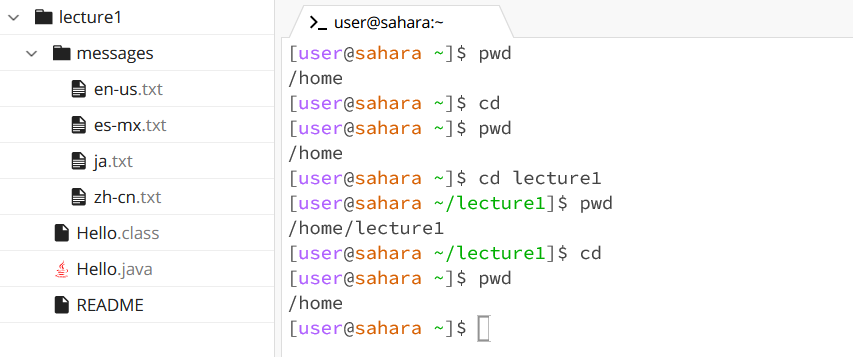
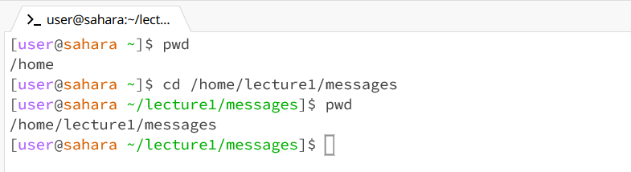
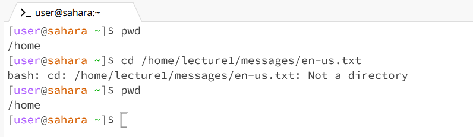
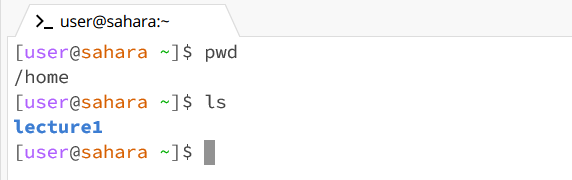
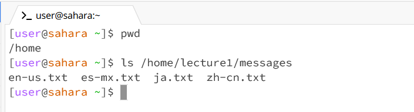
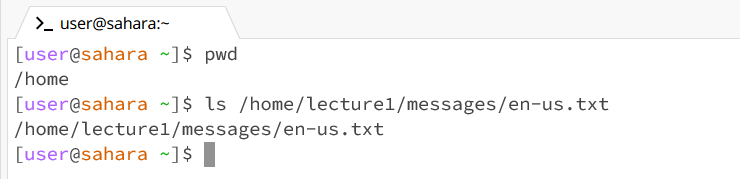
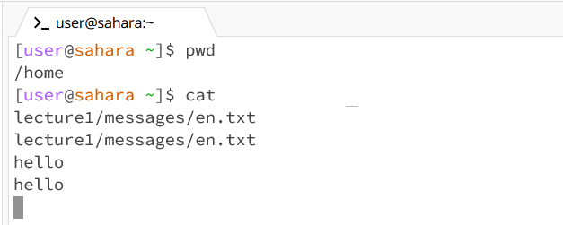
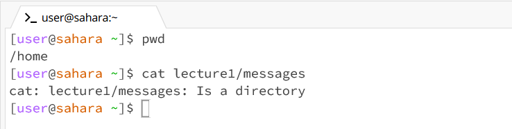
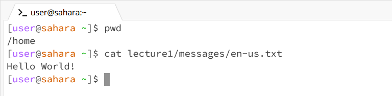

# CSE 15L Lab Report 1 - Remote Access and FileSystem
By: Athena Taylor

***

## cd
* No Arguments
   

  
>When I ran the `cd` command without arguments with `home` as my working directory, nothing changed. In contrast, when I ran the `cd` command without arguments with `lecture1` as my working directory, my working directory changed to `home`. These outputs are not errors. Since I did not provide a directory to change to as an argument, the computer switched my current working directory to the default, which is `home`.

* A Directory as an Argument

>When I ran the `cd` command with `/home/lecture1/messages` as the argument and `home` as my working directory, my current working directory was changed to `messages`. This  output is not an error. The command worked exactly how it was outlined in Wednesday's handout; the current working directory was switched to the path passed in, which corresponds to the messages directory.

* A File as an Argument

>When I ran the `cd` command with `/home/lecture1/messages/en-us.txt` as the argument and `home` as my working directory, an error occured. This happened because the path given as an argument corresponds to a file, not a directory. As the name of the command suggests, cd can only change the current working directory to other directories.

## ls
* No Arguments

>When I ran the `ls` command without arguments with `home` as my working directory, the contents of `home`, which were one folder titled `lecture1`, were listed. This output is not an error. Since I didn't pass in anything for the computer to list, it defaulted to listing the contents of my current working directory.

* A Directory as an Argument

>When I ran the `ls` command with `/home/lecture1/messages` as the argument and `home` as my working directory, the contents of the `messages` folder were listed out. This output is not an error. Just as the lecture handout stated, the contents of the path passed in, which corresponds to the messages directory, were listed.

* A File as an Argument

>When I ran the `ls` command with `/home/lecture1/messages/en-us.txt` as the argument and `home` as my working directory, the path of the file `en-us.txt` was displayed. This output is not an error. Since a file is not a folder, it doesn't contain any files or folders for the computer to list out. Thus, it listed out the path of the file, which is the same as the argument passed in.

## cat
* No Arguments

>When I ran the `cat` command without arguments with `home` as my working directory, nothing happened at first. However, after that, the computer would repeat anything I typed in. This isn't an error, though it's unlikely to be an outcome you'd want. Since I didn't pass in any files for it to read, it defaulted to taking input from the terminal and outputting the content of that, which will be the same text you typed in.

* A Directory as an Argument

>When I ran the `cat` command with `lecture1/messages` as the argument and `home` as my working directory, it resulted in an error. This happened because I passed in a path to a directory, and `cat` can only print out the contents of files.

* A File as an Argument

>When I ran the `cat` command with `lecture1/messages/en-us.txt` as the argument and `home` as my working directory, the computer printed out the phrase "Hello World!" This output is not an error. Like the lecture handout stated, the text contained in the `en-us.txt file`, which corresponds to the path I passed in, was printed out.
