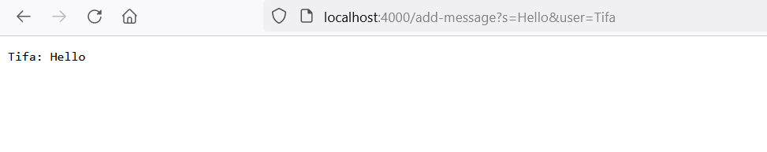
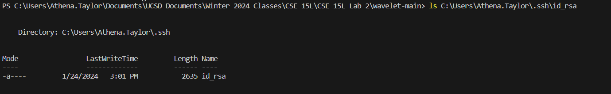
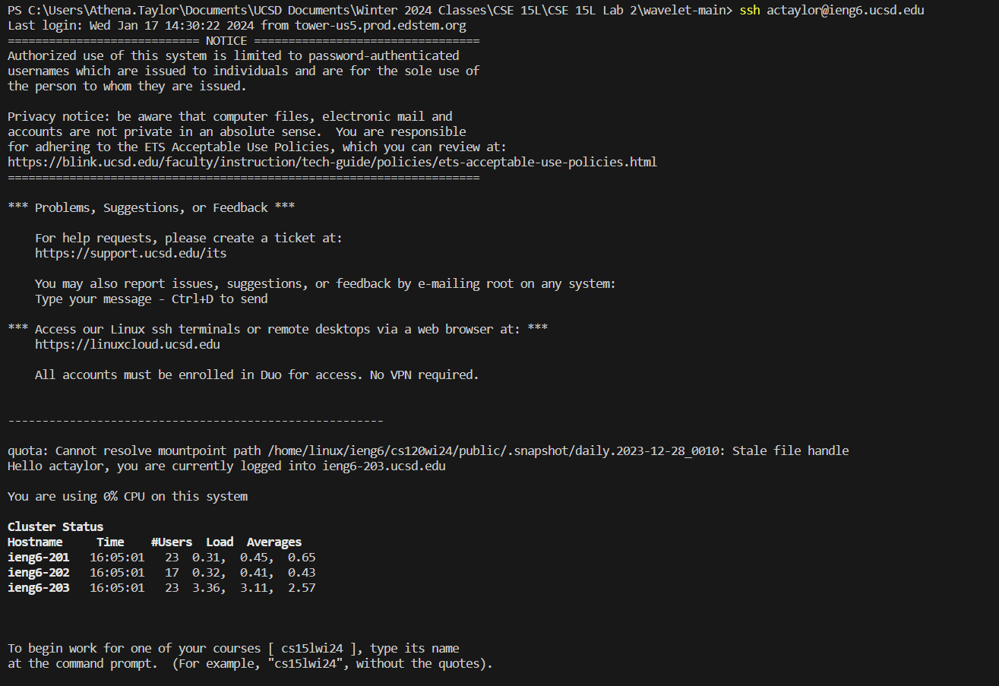

# CSE 15L Lab Report 2 - Servers and SSH Keys
By: Athena Taylor

***

## Part 1
* ChatServer Code

```   
import java.io.IOException;
import java.net.URI;

class Handler implements URLHandler
{
    // This string contains the output that will displayed on the webpage.
    // It's updated based on the incoming requests
    String chatroom = "";

    public String handleRequest(URI url)
    {
        if (url.getPath().equals("/")) 
        {
            return chatroom;
        }
        else if (url.getPath().equals("/add-message")) 
        {
            String[] parameters = url.getQuery().split("=");
            String[] message = parameters[1].split("&");

            chatroom = chatroom + parameters[2] + ": " + message[0] + "\n";

            return chatroom;
        } 
        else 
        {
            return "404 Not Found!";
        }
    }
}

class ChatServer {
    public static void main(String[] args) throws IOException {
        if(args.length == 0){
            System.out.println("Missing port number! Try any number between 1024 to 49151");
            return;
        }

        int port = Integer.parseInt(args[0]);

        Server.start(port, new Handler());
    }
}
```

* /add-message



>Since the server had already been started, the only method that was called was `handleRequest` with the argument `localhost:4000/add-message?s=Hello&user=Tifa`. Before the method was called, the String field `chatroom` was empty. Calling the method with the specified argument concatenated the string `"Tifa: Hello\n"` to `chatroom`.


>Like before, the only method that was called was `handleRequest`. This time, the argument passed in was `localhost:4000/add-message?s=hi!&user=aerith`. Before the method was called, the String field `chatroom` contained the String `"Tifa: Hello\n"` from the above usage of `/add-message`. After the request, the String `"aerith: hi!\n"` was concatenated to `chatroom`.


## Part 2

* Absolute path to private key



* Absolute path to public key


* Logging in without a password



## Part 3

>Before taking this class, I was vaguely aware that something known as `ssh` was important in the field of computer science, but I didn't know what it was or what it did. Now, I can use it to remotely log in to another computer.


