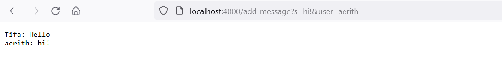
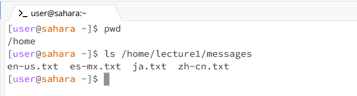
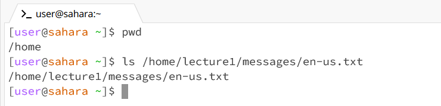
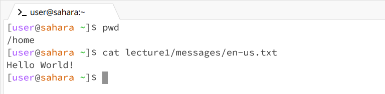

# CSE 15L Lab Report 2 - Servers and SSH Keys
By: Athena Taylor

***

## Part 1
* ChatServer Code

```   
import java.io.IOException;
import java.net.URI;

class Handler implements URLHandler
{
    // This string contains the output that will displayed on the webpage.
    // It's updated based on the incoming requests
    String chatroom = "";

    public String handleRequest(URI url)
    {
        if (url.getPath().equals("/")) 
        {
            return chatroom;
        }
        else if (url.getPath().equals("/add-message")) 
        {
            String[] parameters = url.getQuery().split("=");
            String[] message = parameters[1].split("&");

            chatroom = chatroom + parameters[2] + ": " + message[0] + "\n";

            return chatroom;
        } 
        else 
        {
            return "404 Not Found!";
        }
    }
}

class ChatServer {
    public static void main(String[] args) throws IOException {
        if(args.length == 0){
            System.out.println("Missing port number! Try any number between 1024 to 49151");
            return;
        }

        int port = Integer.parseInt(args[0]);

        Server.start(port, new Handler());
    }
}
```

* /add-message


>Since the server had already been started, the only method that was called was `handleRequest` with the argument `localhost:4000/add-message?s=Hello&user=Tifa`. Before the method was called, the String field `chatroom` was empty. Calling the method with the specified argument concatenated the string "Tifa: Hello\n" to `chatroom`.



>Like before, the only method that was called was `handleRequest`. This time, the argument passed in was `localhost:4000/add-message?s=hi!&user=aerith`. Before the method was called, the String field `chatroom` contained the String "Tifa: Hello\n" from the above usage of `/add-message`. After the request, the String "aerith: hi!\n" was concatenated to `chatroom`.


## ls
* No Arguments


>When I ran the `ls` command without arguments with `home` as my working directory, the contents of `home`, which were one folder titled `lecture1`, were listed. This output is not an error. Since I didn't pass in anything for the computer to list, it defaulted to listing the contents of my current working directory.

* A Directory as an Argument



>When I ran the `ls` command with `/home/lecture1/messages` as the argument and `home` as my working directory, the contents of the `messages` folder were listed out. This output is not an error. Just as the lecture handout stated, the contents of the path passed in, which corresponds to the messages directory, were listed.

* A File as an Argument



>When I ran the `ls` command with `/home/lecture1/messages/en-us.txt` as the argument and `home` as my working directory, the path of the file `en-us.txt` was displayed. This output is not an error. Since a file is not a folder, it doesn't contain any files or folders for the computer to list out. Thus, it listed out the path of the file, which is the same as the argument passed in.

## cat
* No Arguments


>When I ran the `cat` command without arguments with `home` as my working directory, nothing happened at first. However, after that, the computer would repeat anything I typed in. This isn't an error, though it's unlikely to be an outcome you'd want. Since I didn't pass in any files for it to read, it defaulted to taking input from the terminal and outputting the content of that, which will be the same text you typed in.

* A Directory as an Argument


>When I ran the `cat` command with `lecture1/messages` as the argument and `home` as my working directory, it resulted in an error. This happened because I passed in a path to a directory, and `cat` can only print out the contents of files.

* A File as an Argument



>When I ran the `cat` command with `lecture1/messages/en-us.txt` as the argument and `home` as my working directory, the computer printed out the phrase "Hello World!" This output is not an error. Like the lecture handout stated, the text contained in the `en-us.txt file`, which corresponds to the path I passed in, was printed out.
