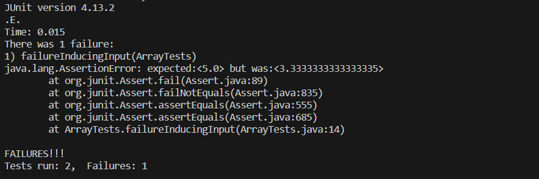

# CSE 15L Lab Report 3 - Bugs and Commands
By: Athena Taylor

***

## Part 1
* Bugged Code
```
static double averageWithoutLowest(double[] arr) {
    if(arr.length < 2) { return 0.0; }
    double lowest = arr[0];
    for(double num: arr) {
      if(num < lowest) { lowest = num; }
    }
    double sum = 0;
    for(double num: arr) {
      if(num != lowest) { sum += num; }
    }
    return sum / (arr.length - 1);
  }
```
* Failure-inducing Input
```
@Test
  public void failureInducingInput() {
    double[] testArray = {2.0, 2.0, 4.0, 6.0};
    double expectedOutput = 5.0;
    double actualOutput = ArrayExamples.averageWithoutLowest(testArray); 
    assertEquals(expectedOutput, actualOutput, 0.001);
  }
```
* Non-failure-inducing Input
```
@Test
  public void nonFailureInducingInput() {
    double[] testArray = {2.0};
    double expectedOutput = 0.0;
    double actualOutput = ArrayExamples.averageWithoutLowest(testArray); 
    assertEquals(expectedOutput, actualOutput, 0.001);
  }
```
* Symptom


* Fixed Code
```
static double averageWithoutLowest(double[] arr) {
    if(arr.length < 2) { return 0.0; }
    double lowest = arr[0];
    for(double num: arr) {
      if(num < lowest) { lowest = num; }
    }
    double sum = 0;
    double numLowest = arr.length;
    for(double num: arr) {
      if(num != lowest) { sum += num; numLowest--; }
    }
    return sum / (arr.length - numLowest);
  }
```
> The original code didn't account for a situation in which the array passed in had multiple copies of the lowest number. So, I added a counter variable to keep track of the number of copies of the lowest variable and subtracted it from arr.length at the end instead of 1.
## Part 2 (Find)
* [Information Source for all Options](https://tecadmin.net/linux-find-command-with-examples/)
* -name
> Working directory for both examples: ~/Documents/UCSD Documents/Winter 2024 Classes/CSE 15L/CSE 15L Lab 5/docsearch
```
$ find ./technical -name 'chapter-8.txt'
./technical/911report/chapter-8.txt
```
```
$ find ./technical -name 'athena-taylor.txt'

```
> find [PATH] -name [EXPRESSION] searchs through the directory provided via PATH for files and directories named the string provided via EXPRESSION. As you can see in the first example, if it finds a file or directory that matches the name provided, it will return the path of the file or directory. As you can see in the second example, it won't return anything if it cannot find a file or directory that matches the criteria. This command is useful if you're trying to find a specific file in a massive repository.
* -type 
