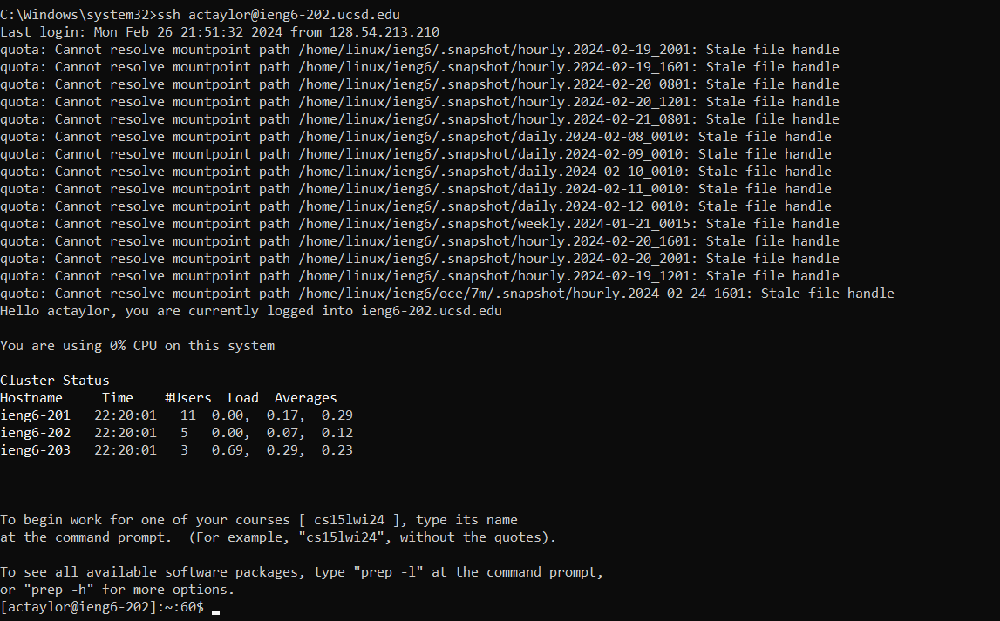
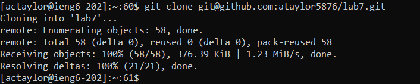
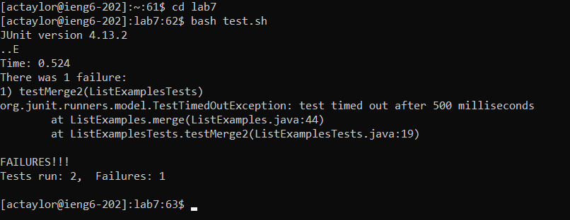
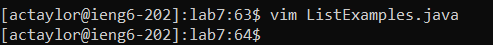
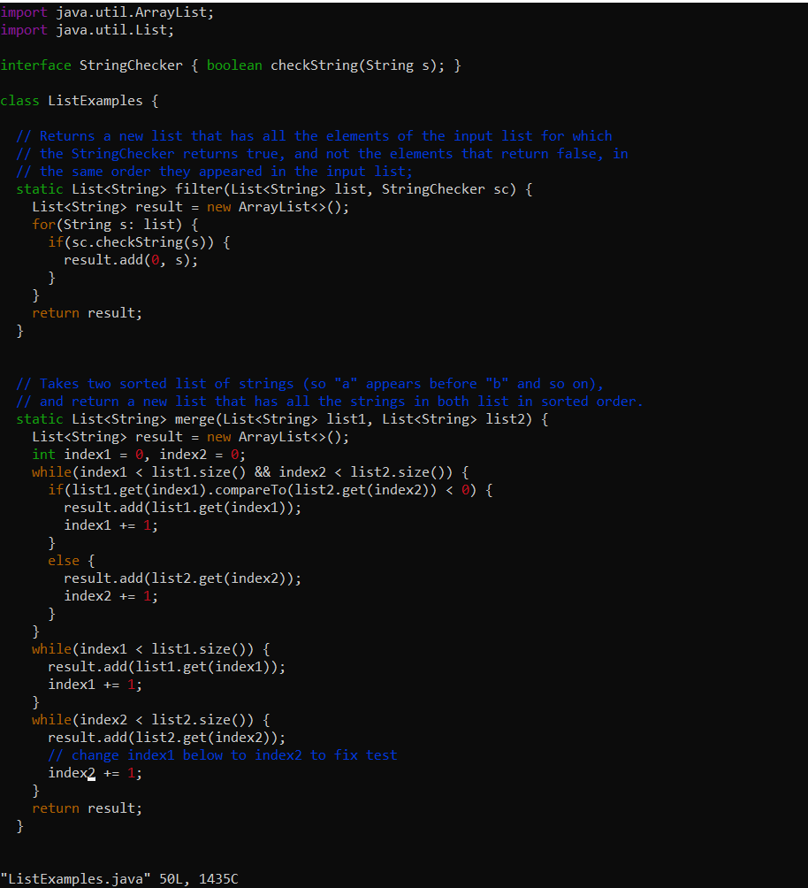
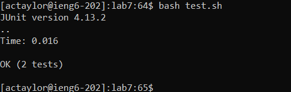
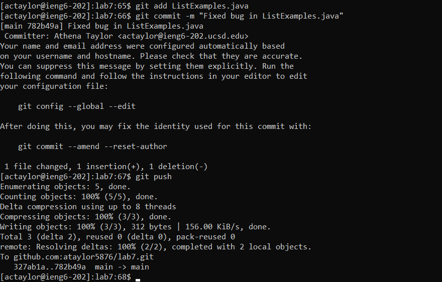

# CSE 15L Lab Report 4 - Vim
By: Athena Taylor

***

## Step 4



```
Keys Pressed: ssh actaylor@ieng6-202.ucsd.edu<enter>
```

> I logged into my ieng6 account using the standard command.


## Step 5



```
Keys Pressed: git clone <Ctrl+v><enter>
```

> I cloned my fork using the ssh clone URL, which I had copied to my clipboard.

## Step 6



```
Keys Pressed: cd lab<enter>
              bash test.sh<enter>
```

> I changed my working directory to the cloned lab7 repository using the `cd` command. I then ran the `test.sh` script, which contains the commands that compile all the java files and run the tests.


## Step 7





```
Keys Pressed: vim L<tab>.java<enter>
              /index1<enter>
              nnnnnnnnnlllllxi2<esc>:wq<enter>
```

> I used vim to edit the code in `ListExamples.java`, which I used `tab` to type faster. I then used `/index1` to search for the first instance of `index1` in the text. I then repeatedly pressed `n` to cycle through
> the instances until I found the one I needed to edit. I also used `l` repeatedly to move the cursor to the end of the word. I then used `x` to delete the last character and `i2<esc>` to replace it. Finally, I used
> `:wq<enter>` to save the file and exit.

## Step 8



```
Keys Pressed: <up><up><enter>
```

> The `bash test.sh` command was 2 up in the search history, so I used the `up arrow` to access it.

## Step 9



```
Keys Pressed: git add Li<tab><enter>
              git commit -m "Fixed bug in ListExamples.java"
              git push
```

> I used the `git add ListExamples.java` to register the changed file in the repository. I used `tab` to type `ListExamples.java` faster. I then used `git commit -m "Fixed bug in ListExamples.java"` to commit the       > change I made. Finally, I used `git push` to apply the change to the `main` branch.
