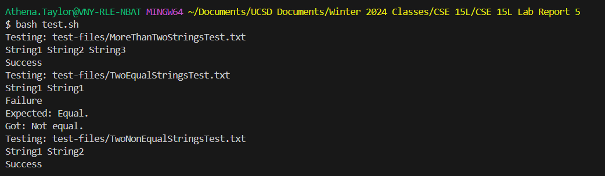

# CSE 15L Lab Report 5 - Putting it All Together
By: Athena Taylor

***

## Part 1
* Initial Post
> Jane Doe
>   
> Hi!  
> I wrote a Java program that checks if two strings given as command line arguments are equal and a bash script that runs some test cases. However, the test case for two equal strings is failing, and I can't figure out why.
 Here's a screenshot:



> Could you help me figure out what the problem is?

* TA Response
> Athena Taylor  
>
>   
> Hi Jane.
> You'll have to post the contents of the Java file and your bash script otherwise I can't really determine what the problem is. However, if it's just the equals case that's failing, have you made sure you're comparing the actual strings and not their references?


* Student Follow-up
> Jane Doe
>
> You were right! I used the equals method to compare the strings instead of != and now all the test cases are working.


> Thank you!

* Setup Information
> File Structure


> File Contents

> `MoreThanTwoStringsTest.txt`
```
String1 String2 String3
```
> `MoreThanTwoStringsTest.txt.expect`
```
Please give two strings as input.
```
> `TwoEqualStringsTest.txt`
```
String1 String1
```
> `TwoEqualStringsTest.txt.expect`
```
Equal.
```
> `TwoNonEqualStringsTest.txt`
```
String1 String2
```
> `TwoNonEqualStringsTest.txt.expect`
```
Not equal.
```
> `StringChecker.java`
```
public class StringChecker
{
    // Checks if two strings given at the command line are equal
    public static void main(String[] args)
    {
        if (args.length != 2)
        {
            System.out.println("Please give two strings as input.");
        }
        else
        {
            if (args[0] != args[1])
            {
                System.out.println("Not equal.");
            }
            else
            {
                System.out.println("Equal.");
            }
        }
    }
}
```
> `test.sh`
```
set -e
javac StringChecker.java

for TEST in test-files/*.txt 
do
    echo "Testing: $TEST"
    cat $TEST
    echo " "

    OUTPUT=$(java StringChecker $(cat $TEST))
    
    EXPECTED=$(cat $TEST.expect)
    if [[ $OUTPUT == $EXPECTED ]]
    then
        echo "Success"
    else
        echo "Failure"
        echo "Expected: $EXPECTED"
        echo "Got: $OUTPUT"
    fi
done
```

> Command to Trigger Bug

```
bash tesh.sh
```

> Fix

> Change line 12 in StringChecker.java from `if(args[0] != args[1])` to `if(!(args[0].equals(args[1])))`


## Part 2
> I learned how to use the Java Debugger tool, which allows you to examine a Java program at any point during its runtime. I'm happy about this because it's quicker than manually writing print statements, which is what I was doing before.


